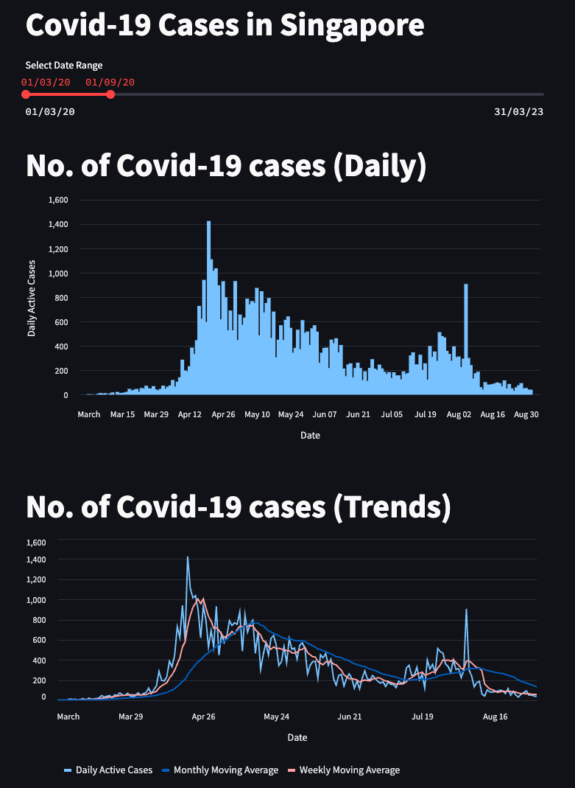

# Screenshot
<p align="center">
    
</p>

# Prerequisite
- Python 3
- Pip

# Technologies
- Requests
- Pandas
- Streamlit

# Setup
```
# Create new Python environment
python -m venv venv

# Activate Python environment
source venv/bin/activate

# Install dependencies
pip install -r requirements.txt
```

# Invoke API
```
python invoke_api.py
```

# Start Dashboard
```
streamlit run streamlit.py
```