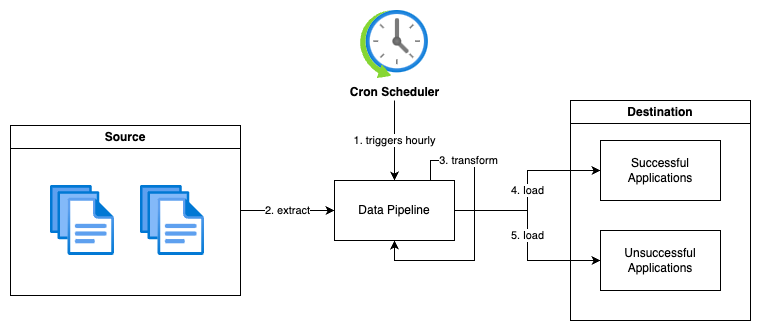

# System Diagram

<p align="center">
    
</p>

# Prerequisites
- Python 3
- Pip

# Technologies
- Pandas

# Setup
1. Create new Python virtual environment
    ```
    python -m venv venv
    ```
2. Activate Python virtual environment
    ```
    source venv/bin/activate
    ```
3. Install Python dependencies
    ```
    pip install -r requirements.txt
    ```
4. Copy data-pipeline directory to home directory
    ```
    cp -r ../data-pipelines ~/
    ```
5. Setup crontab, batch job will be triggered hourly
    ```
    # Open crontab
    crontab -e

    # Copy & save the following line into the crontab
    0 * * * * sh ~/data-pipelines/run.sh
    ```

# Run

1. Execute the following command
    ```
    python src/main.py \
        --input_dir input/ \
        --success_dir output/success \
        --unsuccessful_dir output/unsuccessful
    ```

    > Note: Files in the input directory will be deleted after successful execution