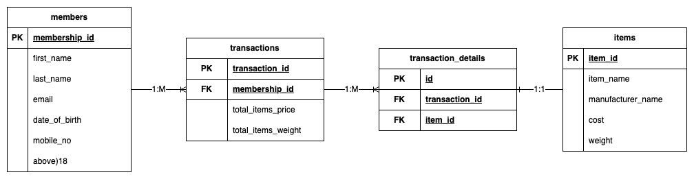

# ER Diagram
<p align="center">
    
</p>

# Prerequisites
- Docker Engine

# Technologies
- Docker
- PostgreSQL

# Setup
1. Build custom PostgreSQL Docker image, pull official PostgreSQL image and add create_table.sql to create tables upon container start up
    ```
    sh scripts/build.sh
    ```

# Run
1. Start Docker container, new database and tables will be created upon start
    ```
    sh scripts/run.sh
    ```

# SQL Queries
1. Which are the top 10 members by spending?
    ```

    ```
2. Which are the top 3 items that are frequently brought by members
    ```

    ```