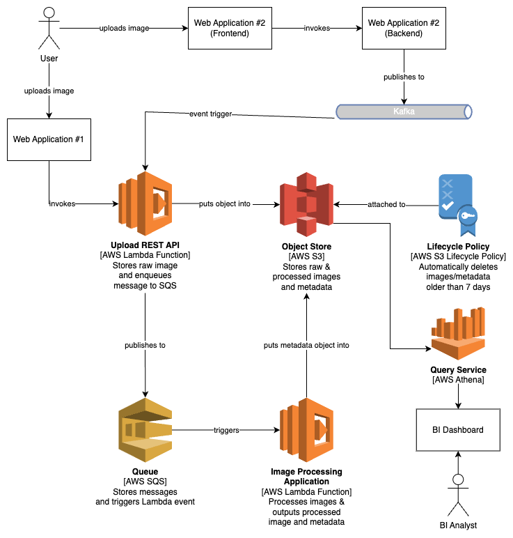

# System Diagram

    

# Assumptions

## High-level System Requirements

### Functional Requirements
1. Users should be able to upload image via Web Application #1
2. Users should be able to upload image via Web Application #2
3. Analysts should be able to use Business Intelligence tool(s) to perform analytics

### Non-functional Requirements
1. System should be able to dynamically scale up/down in response to current load
2. End-users should receive feedback of system status within seconds after uploading image

# Main Considerations
1. Highly Available
    - Use of cloud services with 99.999% uptime
2. Scalable
    - Using serverless compute that is highly scalable on demand
3. Cost-effective
    - Using serverless compute that is charged by the compute amount & time used
4. Low touch-points
    - Using serverless compute to avoid having to manage provisioned compute (EC2s)
    - Scales up/down dynamically without configuring autoscaling policies etc.
    - Automatically handles lifecycle (i.e. deletion for compliancy) of files
5. Reusability
    - Lambda API is reusable for both web application #1 and #2
    - Lambda application for processing images is a generalised component
    
# Sequence of Events

## Web Application #1
1. User uploads image via web application
2. Web application invokes REST API (Lambda) 
3. Lambda function uploads raw image to AWS S3 (input directory), enqueues message (i.e. metadata, S3 URI etc.) to SQS and returns success message to client (web application)
4. SQS triggers Image Processing Application (Lambda)
5. Image Processing Application (Lambda) processes image, outputs processed image and metadata into AWS S3

## Web Application #2
1. User uploads image via web application
2. Web application invokes backend REST API, produces message into Kafka and returns success message to client
3. Kafka triggers Lambda function
4. Lambda function uploads raw image to AWS S3 (input directory), enqueues message (i.e. metadata, S3 URI etc.) to SQS
5. SQS triggers Image Processing Application (Lambda)
6. Image Processing Application (Lambda) processes image, outputs processed image and metadata into AWS S3